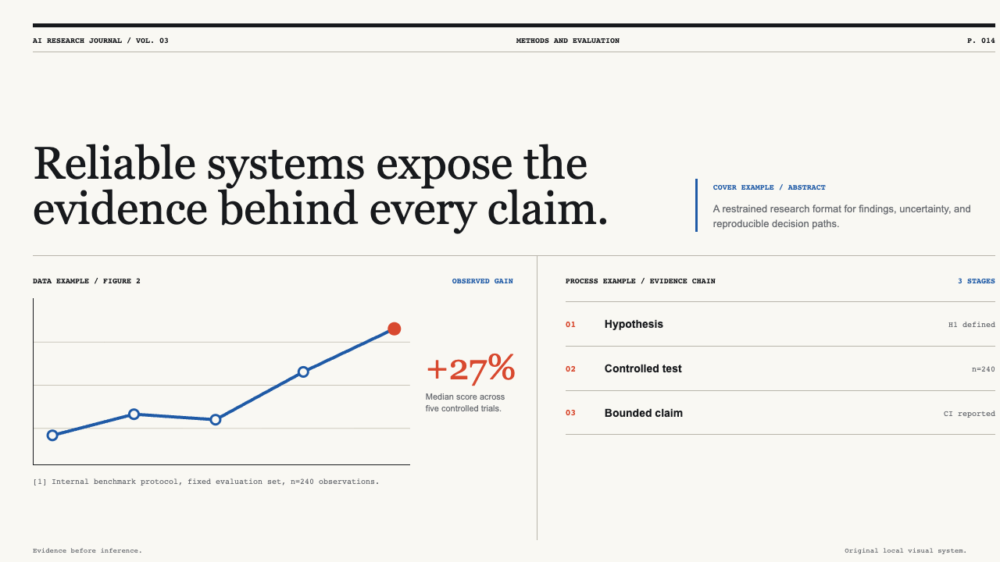
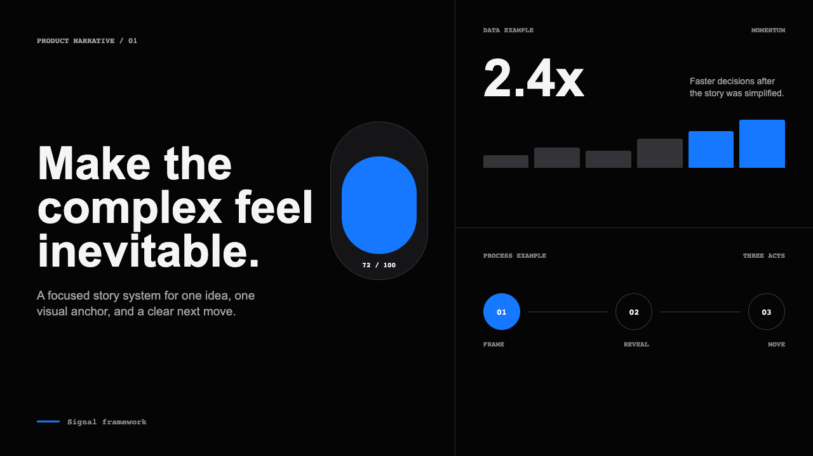
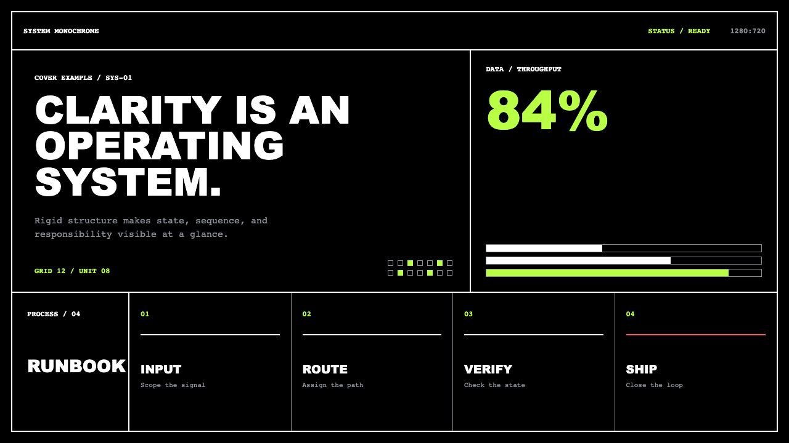
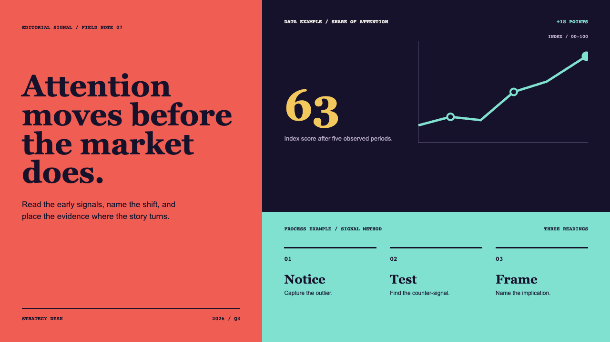
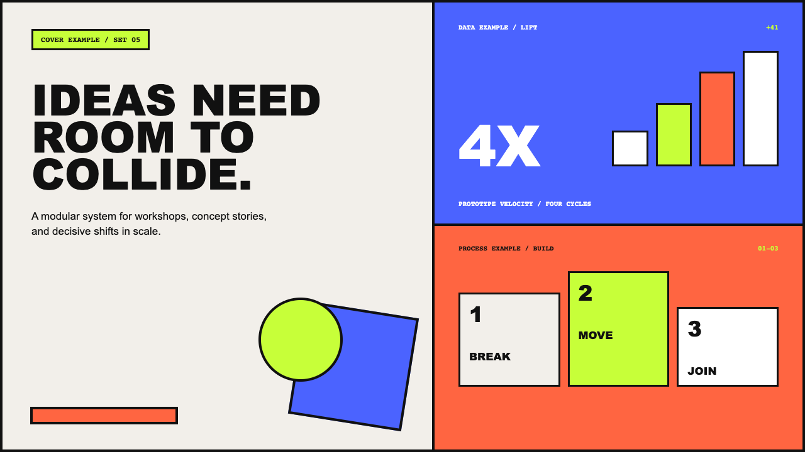

# Sherry Skill for HTML

一个可复用的演示文稿工作流 Skill，适合把主题、目标和素材逐步整理成可演示、可修改的 HTML PPT，也可以按需生成 PPTX。它强调先问清楚，再制作；每个关键阶段都要得到确认，避免把一份素材直接粗暴地转换成页面。

> 先看效果：打开 [Showcase](showcase/index.html)，或直接体验 [5 页 HTML 示例](examples/ai-workflow-demo/index.html)。


## 它解决什么问题

- 通过多轮提问澄清主题、目的、受众、时长、边界和交付格式。
- 把完整素材库整理成 `content-source.md`，再生成逐页 `outline.md`。
- 提供六套科技感、高级、未来感的视觉风格作为选择池。
- 按自然章节制作，生成截图并确认文字溢出、信息密度和视觉连续性。
- HTML 是正式修改源，CSS 和页面结构可以手动调整；PPTX 是按需导出版本。
- 演讲讲稿只保存在独立 Markdown 文件，不显示在 HTML 页面上。
- 访谈是可选素材，不会被默认假设为每次制作流程的一部分。

## 调用方式

本 Skill 只在明确调用时触发，不会因为普通的“做一个 PPT”自动接管：

```text
/sherry-skillforhtml2026
请帮我把这批素材做成一份面向业务团队的分享。
```

也可以在调用时直接提供已经确认的 Markdown。Skill 会先自查内容是否足够清楚，并继续提问直到你确认需求，再进入后续阶段。

## 默认流程

`需求说明 → 调研决策 → 网络调研/事实查证（可选） → 完整 MD 素材库 → 输出格式 → 视觉风格 → 逐页大纲 → 视觉样张 → 分章节制作 → 截图确认 → 局部修改 → 单文件合并`

关键阶段默认逐一确认：需求、内容、格式与讲稿、风格、大纲、样张、章节、最终产物。制作章节时，如果一章超过 5 页，会询问一次生成整章还是先生成 5 页；赶时间时可以明确开启快速模式，但快速模式不能跳过确认门禁。

内容整理前会先询问是否需要外部信息：可以选择“需要网络调研，帮我完善内容”“只查证事实，不扩展内容”，或“不需要调研，直接基于现有素材”。采用的事实、案例和素材会进入 `content-source.md` 与来源清单，未采用或授权不清的内容不会进入页面。

## 两种快捷入口

如果 Markdown 已经确认过，可以自然地说“这份 MD 已敲定，直接进入后面的流程”“内容不用改了，从风格开始”等。Skill 按意图识别，不要求固定口令；它静默完成生产阻塞检查，不重做需求访谈、不重复确认内容，然后把输出格式、讲稿和视觉模板合并成一轮选择。

如果已有 HTML 想换模板，可以说“换个风格”“视觉升级”“套一版科技模板”或“换皮”，不必强调“只”。Skill 会检查页面、素材、页数、溢出和离线运行，再展示模板；选择模板本身就是确认。少量文案可以顺带修改，只有增删页面、调整章节或重写核心内容时才回到正常流程。

确认支持自然表达，例如“可以，继续”“好的，进入下一步”“这一页没问题”“确认开始制作”。如果同一条消息同时提出修改，就会先处理修改，不会误判为通过；“大概可以”“先看看”等含糊表达会继续追问。

## 输出结构

每个项目包含需求、素材库、大纲、样张、章节源文件、截图、HTML/PPTX 输出和来源清单。HTML 为单文件，方便浏览器演示和手动修改；讲稿若需要，会单独生成 `speaker-notes.md`。

## 六套风格

内置风格池包括：深色科技、未来实验室、极简数据、编辑部科技、明亮产品和高端黑银。开始制作前会展示可选模板和视觉对比页；你可以选择主风格，也可以选择一套辅助风格，但不会在整套页面中无规则混用。

## 查看成品与模板

- [Showcase：成品入口、制作流程和六套风格](showcase/index.html)
- [AI 工作流示例：5 页可翻页 HTML](examples/ai-workflow-demo/index.html)
- [模板预览目录](assets/style-pool/)

示例页面使用仓库内的 HTML、CSS 和图片素材，下载仓库后可以直接打开；它们用于展示能力和视觉方向，不代表 Skill 对所有主题都固定使用同一套版式。

| 风格 | 预览 |
| --- | --- |
| AI Research Journal |  |
| Insight Editorial |  |
| Product Narrative |  |
| System Monochrome |  |
| Editorial Signal |  |
| Creative Primitives |  |

## 本地开发

需要 Node.js 20+、Python 3.10+、npm，以及用于截图和 PPTX 验证的 Chromium、LibreOffice 和 `pdftoppm`。安装依赖：

```bash
npm install
python3 -m pip install -r requirements-dev.txt
npx playwright install chromium
```

运行测试：

```bash
npm test
npm run test:python
npm run check:open-source
```

完整的 Codex Skill 规范校验由 Codex 的 `skill-creator` 提供；在 Codex 环境中可使用它的 `quick_validate.py` 对仓库进行官方校验。PPTX 截图验证还需要本机安装 LibreOffice 和 Poppler。

## 许可证

本项目采用 [MIT License](LICENSE)。

## English quick start

Install Node.js 20+, Python 3.10+, npm, and the rendering tools. Run `npm install`, `python3 -m pip install -r requirements-dev.txt`, and `npx playwright install chromium`. In Codex, explicitly invoke `/sherry-skillforhtml2026`, provide your topic and source material, and approve each gate when the draft is ready. The generated single-file HTML remains the editable source; PPTX and speaker notes are optional outputs.
